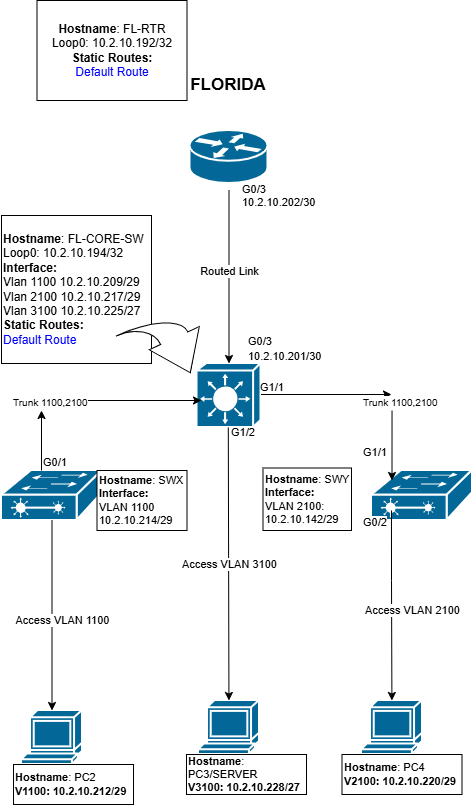

# 🧱 Tech Warrior Lab – VLAN + TRUNK + SVI
> Built and documented by **Charly "Tech Warrior" Feuille**

---

## 🔍 Objective
Demonstrate VLAN segmentation and trunking across two switches, including management VLAN setup and SVI configuration.

---

## 🗺️ Topology


---

## ⚙️ Configuration Summary — Best Practices

```bash
conf t
interface vlan 1
 shutdown
exit

vlan 99
 name MANAGEMENT
exit

interface g0/0
 switchport trunk allowed vlan remove 1
 switchport trunk allowed vlan add 99
exit

interface vlan 99
 ip address 192.168.99.1 255.255.255.0
 no shutdown
exit

interface g0/0
 switchport trunk native vlan 99
 switchport trunk allowed vlan 10,20,30,99
exit
```

---

## 🔧 Trunk Connection Rules

If the trunk connects to:
- another switch  
- a router-on-a-stick  
- a firewall  
- or a Layer 3 switch  

…then **both sides must match** the native VLAN and allowed VLAN list.

```bash
